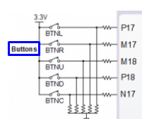
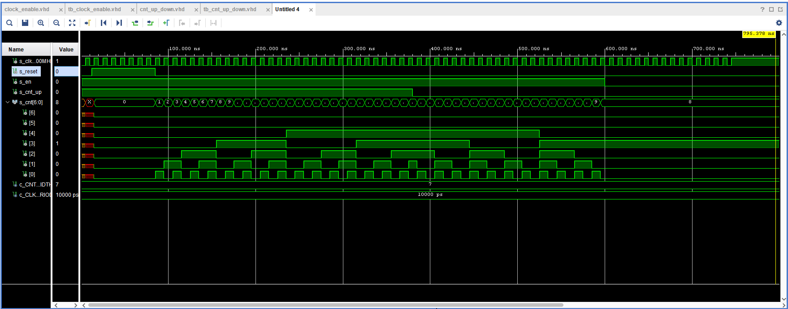
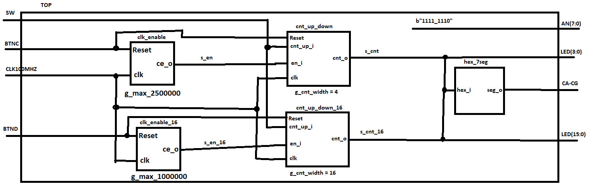

# Lab assingment 05-counter


## 1.Preparation task:

### Figure or table with connection of push buttons on Nexys A7 board,


### Table with calculated values.
| **Time interval** | **Number of clk periods** | **Number of clk periods in hex** | **Number of clk periods in binary** |
| :-: | :-: | :-: | :-: |
| 2&nbsp;ms | 200 000 | `x"3_0d40"` | `b"0011_0000_1101_0100_0000"` |
| 4&nbsp;ms | 400 000 | `x"6_1a80"` | `b"0110_0001_1010_1000_0000"` |
| 10&nbsp;ms|1 000 000 | `x"f_4240"` | `b"1111_0100_0010_0100_0000"` |
| 250&nbsp;ms |25 000 000 | `x"17d_7840"` | `b"0001_0111_1101_0111_1000_0100_0000"` |
| 500&nbsp;ms |50 000 000 | `x"2fa_f080"` | `b"0010_1111_1010_1111_0000_1000_0000"` |
| 1&nbsp;sec | 100 000 000 | `x"5F5_E100"` | `b"0101_1111_0101_1110_0001_0000_0000"` |

## 2.Bidirectional counter

### Listing of VHDL code of the process p_cnt_up_down with syntax highlighting:
```vhdl
p_cnt_up_down : process(clk)
    begin
        if rising_edge(clk) then
        
            if (reset = '1') then               -- Synchronous reset
                s_cnt_local <= (others => '0'); -- Clear all bits

            elsif (en_i = '1') then       -- Test if counter is enabled

            if(cnt_up_i = '1') then-- TEST COUNTER DIRECTION HERE
                s_cnt_local <= s_cnt_local +1;
            else
                s_cnt_local <= s_cnt_local -1;
            end if;

            end if;
        end if;
    end process p_cnt_up_down;
```

### Listing of VHDL reset and stimulus processes from testbench file tb_cnt_up_down.vhd with syntax highlighting and asserts:
```vhdl
p_reset_gen : process
    begin
        s_reset <= '0';
        wait for 12 ns;
        
        -- Reset activated
        s_reset <= '1';
        wait for 73 ns;

        s_reset <= '0';
        wait;
    end process p_reset_gen;

    --------------------------------------------------------------------
    -- Data generation process
    --------------------------------------------------------------------
    p_stimulus : process
    begin
        report "Stimulus process started" severity note;

        -- Enable counting
        s_en     <= '1';
        
        -- Change counter direction
        s_cnt_up <= '1';
        wait for 380 ns;
        s_cnt_up <= '0';
        wait for 220 ns;

        -- Disable counting
        s_en     <= '0';

        report "Stimulus process finished" severity note;
        wait;
    end process p_stimulus;
```

### Screenshot with simulated time waveforms; always display all inputs and outputs:


## 3.Top level. Submit:

### Listing of VHDL code from source file top.vhd with all instantiations for the 4-bit bidirectional counter:
```vhdl
library IEEE;
use IEEE.STD_LOGIC_1164.ALL;
use IEEE.numeric_std.ALL;

-- Uncomment the following library declaration if using
-- arithmetic functions with Signed or Unsigned values
--use IEEE.NUMERIC_STD.ALL;

-- Uncomment the following library declaration if instantiating
-- any Xilinx leaf cells in this code.
--library UNISIM;
--use UNISIM.VComponents.all;

entity top is
    Port ( CLK100MHZ : in STD_LOGIC;
           BTNC : in STD_LOGIC;
           SW : in STD_LOGIC_VECTOR (1-1 downto 0);
           LED : out STD_LOGIC_VECTOR (4-1 downto 0);
           CA : out STD_LOGIC;
           CB : out STD_LOGIC;
           CC : out STD_LOGIC;
           CD : out STD_LOGIC;
           CE : out STD_LOGIC;
           CF : out STD_LOGIC;
           CG : out STD_LOGIC;
           AN : out STD_LOGIC_VECTOR (8-1 downto 0));
end top;
------------------------------------------------------------------------
-- Architecture body for top level
------------------------------------------------------------------------
architecture Behavioral of top is

    -- Internal clock enable
    signal s_en  : std_logic;
    -- Internal counter
    signal s_cnt : std_logic_vector(4 - 1 downto 0);

begin

    --------------------------------------------------------------------
    -- Instance (copy) of clock_enable entity
    clk_en0 : entity work.clock_enable
        generic map(
            --- WRITE YOUR CODE HERE
        g_MAX => 2500000 --250ms
        )
        port map(
            --- WRITE YOUR CODE HERE
            clk => CLK100MHZ,
            reset => BTNC,
            ce_o => s_en
        );

    --------------------------------------------------------------------
    -- Instance (copy) of cnt_up_down entity
    bin_cnt0 : entity work.cnt_up_down
        generic map(
            --- WRITE YOUR CODE HERE
            g_CNT_WIDTH =>4 --4-bit counter
        )
        port map(
            --- WRITE YOUR CODE HERE
            clk => CLK100MHZ,
            reset => BTNC,
            en_i => s_en,
            cnt_up_i => SW(0),
            cnt_o => s_cnt
        );

    -- Display input value on LEDs
    LED(4-1 downto 0) <= s_cnt;

    --------------------------------------------------------------------
    -- Instance (copy) of hex_7seg entity
    hex2seg : entity work.hex_7seg
        port map(
            hex_i    => s_cnt,
            seg_o(6) => CA,
            seg_o(5) => CB,
            seg_o(4) => CC,
            seg_o(3) => CD,
            seg_o(2) => CE,
            seg_o(1) => CF,
            seg_o(0) => CG
        );

    -- Connect one common anode to 3.3V
    AN <= b"1111_1110";

end architecture Behavioral;
```

### Image of the top layer including both counters, ie a 4-bit bidirectional counter from Part 4 and a 16-bit counter with a 10 ms time base:

