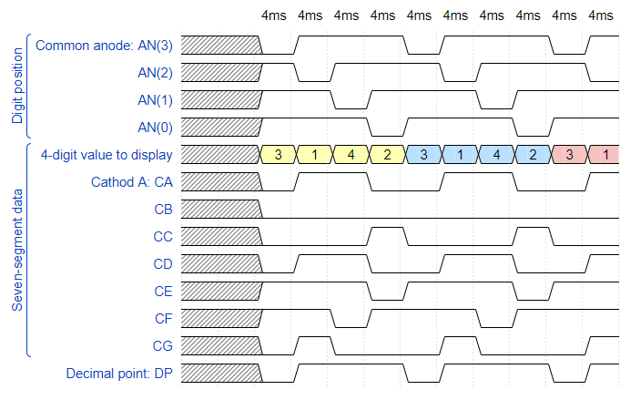
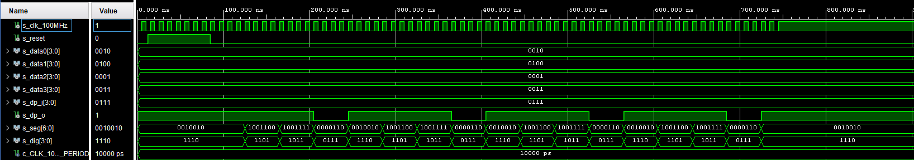
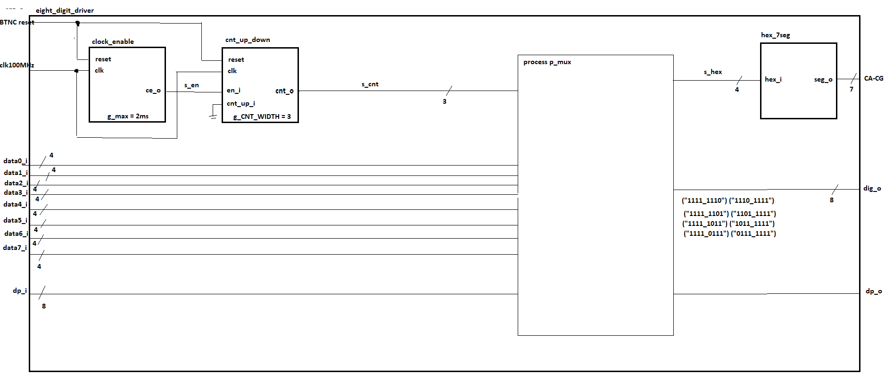

# Lab 06-Display driver

## 1.Preparation tasks (done before the lab at home)
### Timing diagram figure for displaying value 3.142:




## 2.Display driver:
### Listing of VHDL code of the process p_mux with syntax highlighting:

```vhdl
 p_mux : process(s_cnt, data0_i, data1_i, data2_i, data3_i, dp_i)
    begin
        case s_cnt is
            when "11" =>
                s_hex <= data3_i;
                dp_o  <= dp_i(3);
                dig_o <= "0111";

            when "10" =>
                s_hex <= data2_i;
                dp_o  <= dp_i(2);
                dig_o <= "1011";
            when "01" =>
                s_hex <= data1_i;
                dp_o  <= dp_i(1);
                dig_o <= "1101";
            when others =>
               s_hex <= data0_i;
               dp_o  <= dp_i(0);
               dig_o <= "1110";
        end case;
    end process p_mux;
```

### Listing of VHDL testbench file tb_driver_7seg_4digits with syntax highlighting and asserts:

```vhdl
library ieee;
use ieee.std_logic_1164.all;

------------------------------------------------------------------------
-- Entity declaration for testbench
------------------------------------------------------------------------
entity tb_driver_7seg_4digits is
    -- Entity of testbench is always empty
end entity tb_driver_7seg_4digits;

------------------------------------------------------------------------
-- Architecture body for testbench
------------------------------------------------------------------------
architecture testbench of tb_driver_7seg_4digits is

    -- Local constants
    constant c_CLK_100MHZ_PERIOD : time    := 10 ns;

    --Local signals
    signal s_clk_100MHz : std_logic;
    --- WRITE YOUR CODE HERE
    --signal s_clk        : std_logic;
    signal s_reset      : std_logic;
    signal s_data0      : std_logic_vector(4 - 1 downto 0);
    signal s_data1      : std_logic_vector(4 - 1 downto 0);
    signal s_data2      : std_logic_vector(4 - 1 downto 0);
    signal s_data3      : std_logic_vector(4 - 1 downto 0);
    signal s_dp_i       : std_logic_vector(4 - 1 downto 0);
    signal s_dp_o       : std_logic;
    signal s_seg        : std_logic_vector(7 - 1 downto 0);
    signal s_dig        : std_logic_vector(4 - 1 downto 0);

begin
    --- WRITE YOUR CODE HERE
     uut_driver : entity work.driver_7seg_4digits
            port map (
                clk     => s_clk_100MHz,
                reset   => s_reset,
                data0_i => s_data0,
                data1_i => s_data1,
                data2_i => s_data2,
                data3_i => s_data3,
                dp_i    => s_dp_i,
                dp_o    => s_dp_o,  
                seg_o   => s_seg, 
                dig_o   => s_dig
            );
    --------------------------------------------------------------------
    -- Clock generation process
    --------------------------------------------------------------------
    p_clk_gen : process
    begin
        while now < 750 ns loop         -- 75 periods of 100MHz clock
            s_clk_100MHz <= '0';
            wait for c_CLK_100MHZ_PERIOD / 2;
            s_clk_100MHz <= '1';
            wait for c_CLK_100MHZ_PERIOD / 2;
        end loop;
        wait;
    end process p_clk_gen;

    --------------------------------------------------------------------
    -- Reset generation process
    --------------------------------------------------------------------
    --- WRITE YOUR CODE HERE
     p_reset_gen : process
    begin
        s_reset <= '0';
        wait for 12 ns;
        s_reset <= '1';                 -- Reset activated
        wait for 73 ns;
        s_reset <= '0';
        wait;
    end process p_reset_gen;

    --------------------------------------------------------------------
    -- Data generation process
    --------------------------------------------------------------------
    --- WRITE YOUR CODE HERE
     p_stimulus : process
    begin
        report "Stimulus process started" severity note;

        s_data3  <= "0011";           --display n. 4                    (3)       
        s_data2  <= "0001";           --display n. 3                    (1)
        s_data1  <= "0100";           --display n. 2                    (4)
        s_data0  <= "0010";           --display n. 1                    (2)
        s_dp_i   <= "0111";           --decimal point on display n. 4   (.)
        
        wait for 350 ns;
        
    end process p_stimulus;

end architecture testbench;
```

### Screenshot with simulated time waveforms; always display all inputs and outputs:



### Listing of VHDL architecture of the top layer:

```vhdl
architecture Behavioral of top is

begin

 driver_seg_4 : entity work.driver_7seg_4digits
        port map(
            clk        => CLK100MHZ,
            reset      => BTNC,
            dp_o       => DP,
            
            data0_i(3) => SW(3),
            data0_i(2) => SW(2),
            data0_i(1) => SW(1),
            data0_i(0) => SW(0),
            dp_i => "0111",
            
            data1_i(3) => SW(7),
            data1_i(2) => SW(6),
            data1_i(1) => SW(5),
            data1_i(0) => SW(4),
            
            data2_i(3) => SW(11),
            data2_i(2) => SW(10),
            data2_i(1) => SW(9),
            data2_i(0) => SW(8),
            
            data3_i(3) => SW(15),
            data3_i(2) => SW(14),
            data3_i(1) => SW(13),
            data3_i(0) => SW(12),
            
            dig_o(0) => AN(0),
            dig_o(1) => AN(1),
            dig_o(2) => AN(2),
            dig_o(3) => AN(3),
            
            seg_o(6) => CA,
            seg_o(5) => CB,
            seg_o(4) => CC,
            seg_o(3) => CD,
            seg_o(2) => CE,
            seg_o(1) => CF,
            seg_o(0) => CG
            

        );

    -- Disconnect the top four digits of the 7-segment display
    AN(7 downto 4) <= b"1111";

end Behavioral;
```

## Eight-digit driver:
### Image of the driver schematic. The image can be drawn on a computer or by hand:

