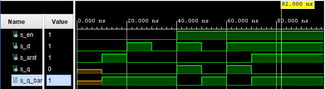
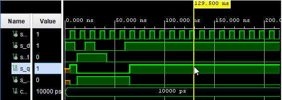
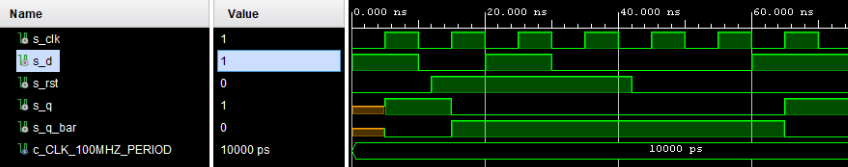
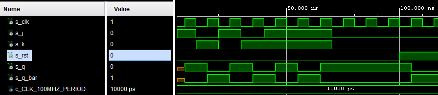
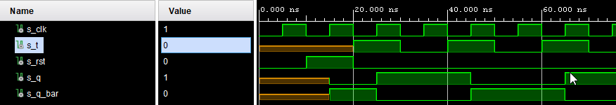
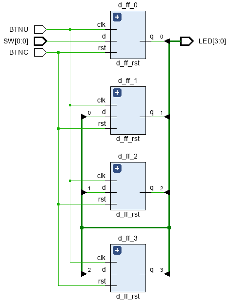

# Lab 07-Latches and Flip-flops

## Preparation tasks (done before the lab at home):

### Characteristic equations and completed tables for D, JK, T flip-flops:

```verilog
   D flip flop: q_(n+1) = d
   JK flip flop: q_(n+1) = j * (not q_n) + (not k) * q_n
   T flip flop: q_(n+1) = t * (not q_n) + (not t) * q_n
```

| **D** | **Qn** | **Q(n+1)** | **Comments** |
| :-: | :-: | :-: | :-- |
| 0 | 0 | 0 | No change |
| 0 | 1 | 0 | Change |
| 1 | 1 | 1 | No change |
| 1 | 0 | 1 | Change |

| **J** | **K** | **Qn** | **Q(n+1)** | **Comments** |
| :-: | :-: | :-: | :-: | :-- |
| 0 | 0 | 0 | 0 | No change |
| 0 | 0 | 1 | 1 | No change |
| 0 | 1 | 0 | 0 | Reset |
| 0 | 1 | 1 | 0 | Reset |
| 1 | 0 | 0 | 1 | Set |
| 1 | 0 | 1 | 1 | Set |
| 1 | 1 | 0 | 1 | Toggle |
| 1 | 1 | 1 | 0 | Toggle |

| **T** | **Qn** | **Q(n+1)** | **Comments** |
| :-: | :-: | :-: | :-- |
| 0 | 0 | 0 | No change |
| 0 | 1 | 1 | No change |
| 1 | 0 | 1 | Toggle |
| 1 | 1 | 0 | Toggle |

## D latch:

### VHDL code listing of the process p_d_latch with syntax highlighting,
```vhdl
 p_d_latch: process(en, d, arst)
    begin
        if(arst = '1')then
            q <= '0';
            q_bar <= '1';
        elsif (en = '1') then
            q <= d;
            q_bar <= not d;    
        end if;
        
    end process p_d_latch;
```

### Listing of VHDL reset and stimulus processes from the testbench tb_d_latch.vhd file with syntax highlighting and asserts,
```vhdl
p_stimulus : process
    begin
        -- Report a note at the begining of stimulus process
        report "Stimulus process started." severity note;
        
        s_en    <=  '0';
        s_arst  <=  '0';
        s_d     <=  '0'; 
        wait for 10 ns; 
        s_arst  <=  '1'; 
        wait for 10 ns;
        s_arst  <=  '0'; 
        
        s_d     <=  '1';
        wait for 10ns;        
        s_d     <=  '0';
        wait for 10ns;
        
        s_en    <=  '1';
        s_d     <=  '1';
        wait for 10ns;      
        s_en    <=  '1';
        s_d     <=  '0';
        wait for 10ns;
        
        s_en    <=  '1';
        s_d     <=  '1';
        wait for 10ns;
        s_arst  <=  '1';
        
        report "Stimulus process end. ---------------------------------------" severity note;
        wait;
    end process p_stimulus;
```

### Screenshot with simulated time waveforms; always display all inputs and outputs. The full functionality of the entity must be verified.



## Flip-flops

### VHDL code listing of the processes p_d_ff_arst, p_d_ff_rst, p_jk_ff_rst, p_t_ff_rst with syntax highlighting,

### p_d_ff_arst design:
```vhdl
architecture Behavioral of d_ff_arst is

begin
 p_d_ff_arst : process(clk, arst)
    begin
        if(arst = '1')then
            q <= '0';
            q_bar <= '1';
        elsif rising_edge(clk) then
            q <= d;
            q_bar <= not d;    
        end if;
        
    end process p_d_ff_arst;
```

### p_d_ff_arst testbench:
```vhdl
p_stimulus : process
    begin
        -- Report a note at the begining of stimulus process
        report "Stimulus process started" severity note;
        s_d <= '1';
        wait for 10ns;       
        s_d <= '0';
        wait for 10ns;
       
        s_d <= '1';
        wait for 10ns;            
        s_d <= '0';
        wait for 30ns;              
        s_d <= '1';
        wait for 10ns;
                
        report "Stimulus process ended" severity note;
        wait;
    end process p_stimulus;
```

### p_d_ff_rst design:
```vhdl
p_d_ff_rst : process(clk)
    begin        
        if rising_edge(clk) then
            if (rst = '1') then
                q <= '0';
                q_bar <= '1';
            else
                q <= d;
                q_bar <= not d;
            end if;
        end if;
    end process p_d_ff_rst;
```

### p_d_ff_rst testbench:
```vhdl
p_stimulus : process
    begin
        -- Report a note at the begining of stimulus process
        report "Stimulus process started" severity note;
        s_d <= '1';
        wait for 10ns;        
        s_d <= '0';
        wait for 10ns;        
        s_d <= '1';
        wait for 10ns;       
        s_d <= '0';
         wait for 30ns;
        s_d <= '1';
        wait for 25ns;
        
        report "Stimulus process ended" severity note;
        wait;
    end process p_stimulus;
```

### p_jk_ff_rst design:
```vhdl
p_jk_ff_rst : process(clk)
        begin
            if rising_edge(clk) then
                if (rst = '1') then
                    s_q <= '0';
                    s_q_bar <= '1'; 
                else
                    if (j = '0' and k = '0') then 
                        s_q <= s_q;
                        s_q_bar <= s_q_bar; 
                    elsif (j = '0' and k = '1') then 
                        s_q <= '0';
                        s_q_bar <= '1';
                    elsif (j = '1' and k = '0') then 
                        s_q <= '1';
                        s_q_bar <= '0';                 
                    else 
                        s_q <= not s_q;
                        s_q_bar <= not s_q_bar;
                    end if;
                end if;
            end if;
        end process p_jk_ff_rst;
```

### p_jk_ff_rst testbench:
```vhdl
    p_stimulus : process
    begin
        -- Report a note at the begining of stimulus process
        report "Stimulus process started." severity note;
        
        -- Set 1
        s_j <=  '1';
        s_k <=  '0'; 
        wait for 10ns;
        assert (s_q = '1' and s_q_bar = '0') report "Failed 1" severity note;
        
        s_j <=  '0';
        s_k <=  '1';
        wait for 10ns;
                
        s_j <=  '1';
        s_k <=  '0';
        wait for 10ns;
        
        s_j <=  '0';
        s_k <=  '1';    
        wait for 10ns;
        
        s_j <=  '1';
        s_k <=  '1';
        wait for 10ns;
        
        s_j <=  '1';
        s_k <=  '1';
        wait for 10ns;
        
        s_j <=  '1';
        s_k <=  '1';
        wait for 10ns;        
        
        s_j <=  '0';
        s_k <=  '0';
        wait for 10ns;
        
        report "Stimulus process ended." severity note;
        wait;
    end process p_stimulus;
```

### p_t_ff_rst design:
```vhdl
p_t_ff_rst : process(clk)
    begin
        if rising_edge(clk) then
            if (rst = '1') then
                s_q <= '0';
                s_q_bar <= '1'; 
                
             else
                if (t = '0') then
                    s_q <= s_q;
                    s_q_bar <= s_q_bar;
                    
                else
                    s_q <= not s_q;
                    s_q_bar <= not s_q_bar;
                end if;
             end if;
        end if;
    end process p_t_ff_rst;
```

### p_t_ff_rst testbench:
```vhdl
p_stimulus : process
    begin
        -- Report a note at the begining of stimulus process
        report "Stimulus process started." severity note;

        wait for 20 ns;
        s_t <=  '1';
        wait for 10ns;
        s_t <=  '0';
        wait for 10ns;
        s_t <=  '1';
        wait for 10ns;
        s_t <=  '0';
        wait for 10ns;        
        s_t <=  '1';
        wait for 10ns;
        s_t <=  '0';
        wait for 10ns;
      
        report "Stimulus process ended." severity note;
        wait;
    end process p_stimulus;
```


### Listing of VHDL clock, reset and stimulus processes from the testbench files with syntax highlighting and asserts,
#### Clock:
```vhdl
p_clk_gen : process
    begin
        while now < 750 ns loop         -- 75 periods of 100MHz clock
            s_clk <= '0';
            wait for c_CLK_100MHZ_PERIOD / 2;
            s_clk <= '1';
            wait for c_CLK_100MHZ_PERIOD / 2;
        end loop;
        wait;
    end process p_clk_gen;
```

#### Reset
```vhdl
p_reset_gen : process
    begin
        s_arst <= '0';
        wait for 12 ns;
        s_arst <= '1';                 
        wait for 30 ns;
        s_arst <= '0';
        wait;
    end process p_reset_gen;
```

### Screenshot with simulated time waveforms; always display all inputs and outputs. The full functionality of the entities must be verified.
#### p_d_ff_arst:


#### p_d_ff_rst:


#### p_jk_ff_rst:


#### p_t_ff_rst:


## Shift register:
### Image of the shift register schematic. The image can be drawn on a computer or by hand. Name all inputs, outputs, components and internal signals.


